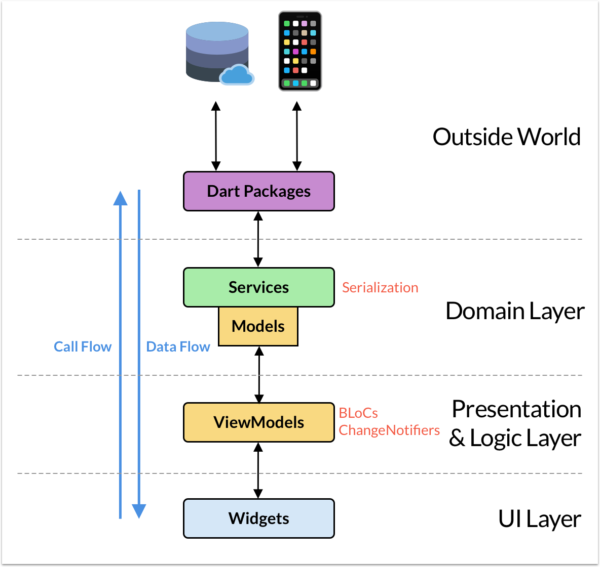
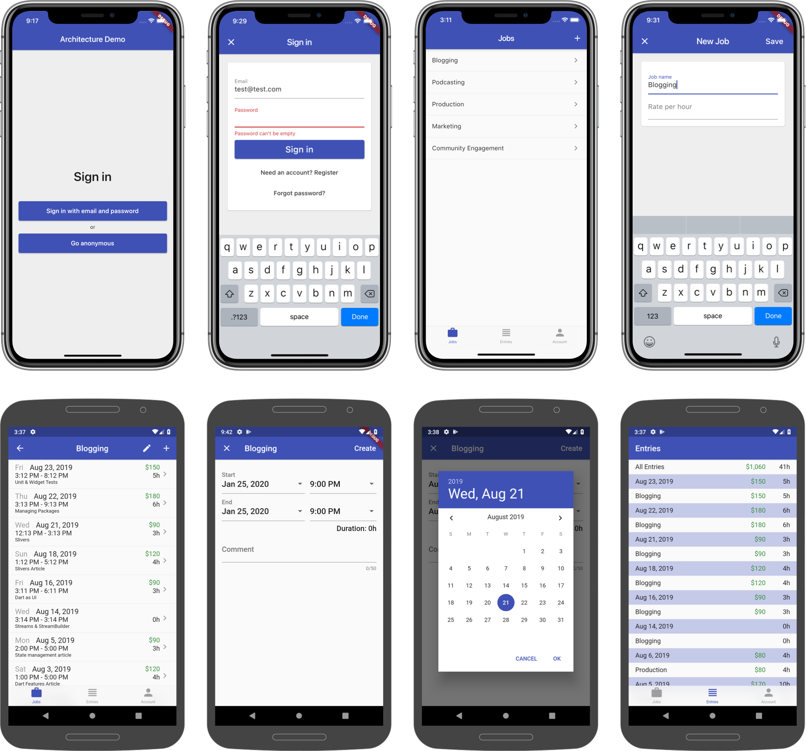
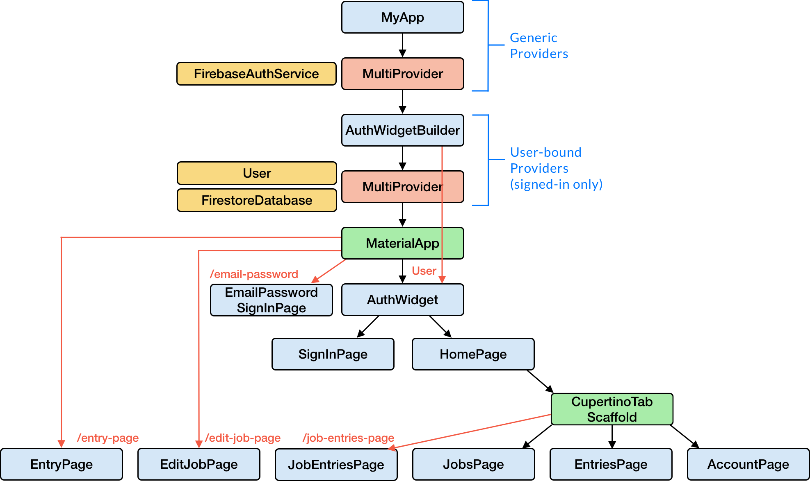

# Starter Architecture Demo for Flutter & Firebase Realtime Apps

This is a **reference architecture demo** that can be used as a **starting point** for apps using Flutter & Firebase.

*Also see my [codewithandrea_flutter_packages repo](https://github.com/bizz84/codewithandrea_flutter_packages), which contains the most reusable parts of this project as packages.*

## Motivation

Flutter & Firebase are a great combo for getting apps to market in record time.

Without a sound architecture, codebases can quickly become hard to test, maintain, and **reason about**. This **severely** impacts the development speed, and results in buggy products, sad developers and unhappy users.

I have already witnessed this first-hand with various client projects, where the lack of a formal architecture led to days, weeks - even **months** of extra work.

Is "architecture" hard? How can one find the "right" or "correct" architecture in the ever-changing landscape of front-end development?

Every app has different requirements, so does the "right" architecture even exist in the first place?

While I don't claim to have a silver bullet, I have refined and fine-tuned a **production-ready** architecture that I have deployed successfully into multiple Flutter & Firebase apps. 

I call this "**Stream-based** Architecture for Flutter & Firebase **Realtime** Apps".

## Stream-based Architecture for Flutter & Firebase Realtime Apps

Two words are key here: **Stream** and **Realtime**.

Unlike with traditional REST APIs, with Firebase we can build **realtime** apps.

That's because Firebase can **push** updates directly to **subscribed** clients when something changes.

For example, widgets can **rebuild** themselves when certain Firestore *documents* or *collections* are updated.

Many Firebase APIs are **inherently** stream-based. As a result, the **simplest** way of making our widgets reactive is to use [`StreamBuilder`](https://api.flutter.dev/flutter/widgets/StreamBuilder-class.html) (or [`StreamProvider`](https://pub.dev/documentation/provider/latest/provider/StreamProvider-class.html)).

Yes, you could use [`ChangeNotifier`](https://api.flutter.dev/flutter/foundation/ChangeNotifier-class.html) or other state management techniques that implement observables/listeners. 

But you would need additional "glue" code if you want to "convert" your input streams into reactive models based on `ChangeNotifier`.

> Note: streams are the default way of pushing changes not only with Firebase, but with many other services as well. For example, you can get location updates with the `onLocationChanged()` stream of the [location](https://pub.dev/packages/location) package. Whether you use Firestore, or want to get data from your device's input sensors, streams are the most convenient way of delivering **asynchronous** data over time.

A more detailed overview of this architecture is outlined below. But first, here are the goals for this project.

## Project Goals

Define a reference architecture that can be used as the **foundation** for Flutter apps using Firebase (or other streaming APIs).

This architecture should:

- **minimize mutable state** by adopting an **unidirectional data flow**
- clearly define application layers and their boundaries
- require little boilerplate code

The resulting code should be:

- clear
- reusable
- scalable
- testable
- performant
- maintainable

These are all nice properties, but how do they all fit together in practice?

By introducing application layers with clear boundaries, and defining how the data flows through them.

## The Application Layers



To ensure a good separation of concerns, this architecture defines three main application layers.

- **UI Layer**: where the widgets live
- **Logic & Presentation Layer**: this contains the application's business and presentation logic
- **Domain Layer**: this contains domain-specific services for interacting with 3rd party APIs

*These layers may be named differently in other literature.*

What matters here is that the data flows from the services into the widgets, and the call flow goes in the opposite direction.

Widgets **subscribe** themselves as listeners, while view models **publish** updates when something changes.

---

The publish/subscribe pattern comes in many variants (e.g. ChangeNotifier, BLoC), and this architecture does not prescribe which one to use.

As a rule of thumb, the most appropriate variant is often the simplest one (on a case-by-case basis). In practice, this means using `Stream`s + `StreamBuilder`/`StreamProvider` when reading and manipulating data from Firestore. But when dealing with **local** application state, `StatefulWidget`+`setState` or `ChangeNotifier` are perfectly acceptable solutions.

Let's look at the three application layers in more detail.

### Domain Layer: Services

Services are **pure**, functional components that don't hold any state.

Services serve as an **abstraction** from external data sources, and provide domain-specific APIs to the rest of the app (more on this below).

Because service APIs return **strongly-typed**, **immutable**, **domain-specific** model objects, the rest of the app doesn't directly manipulate the raw data from the outside world (e.g. Firestore documents represented as key-value pairs).

As a bonus, breaking changes in external packages are easier to deal with, because they only affect the corresponding service classes.

### Presentation & Logic Layer: View Models

View models abstract the widgets' **state** and **presentation**.

View models **do not have any reference** to the widgets themselves. Rather, they define an **interface** for **publishing** updates when something changes. 

View models can talk directly to service classes to read or write data, and access other domain-specific APIs.

But unlike service classes, they can **hold and modify state**, according to some business logic.

View models can also be used to hold **local** state. This is common when converting a `StatefulWidget` into a `StatelessWidget`

> NOTE: View models are **completely independent from the UI**. View model classes never import Flutter code (e.g. `material.dart`)

### UI Layer: Widgets

Widgets are used to specify how the application UI looks like, and provide callbacks in response to user interaction.

Strictly speaking, we can introduce a distinction:

- **pure UI widgets**: these are the usual buttons, texts, containers
- **logic or presentational widgets**: these are used to decide what widget to return, based on some condition (e.g. to return the home page or sign page based on the authentication status of the user).

-----

This project contains a demo app as a practical implementation of this architecture.

## Demo App: Time Tracker

The demo app is a time tracking application. It is complex enough to capture the various nuances of state management across multiple features. Here is a preview of the main screens:



After signing in, users can view, create, edit and delete their jobs. For each job they can view, create, edit and delete the corresponding entries.

A separate screen shows a daily breakdown of all jobs, hours worked and pay, along with the totals.

All the data is persisted with Firestore, and is kept in sync across multiple devices. 

## Widget tree

The two most important services in the app are `FirebaseAuthService` and `FirestoreDatabase`.

These are created above the `MaterialApp`, so that all widgets have access to them.

Here is a simplified widget tree for the entire app:

<!-- TODO: This needs updating -->


[Provider](https://pub.dev/packages/provider) is used in various ways:

- to create view models for widgets that need them (and dispose them when no longer needed).
- to provide **scoped access** to services from the widget classes.
- to propagate data **synchronously** down the widget tree.

The last point is particularly important. Reactive widgets can read data from asynchronous APIs (futures or streams), and make that data available **synchronously** to all their descendants. This minimizes API calls, improves performance, and minimizes boilerplate code.

## Project structure

Folders are grouped by feature/page. Each feature may define its own models and view models.

Services and routing classes are defined at the root, along with constants and common widgets shared by multiple features.

```
/lib
  /app
    /home
      /account
      /entries
      /job_entries
      /jobs
      /models
    /sign_in
  /common_widgets
  /constants
  /routing
  /services
```

This is a purely arbitrary structure. Choose what works best for **your** project.

## Use Case: Firestore Service

Widgets can subscribe to updates from Firestore data via streams.
Equally, write operations can be issued with Future-based APIs.

Here's the entire Database API for the demo app, showing all the possible CRUD operations:

```dart
class FirestoreDatabase { // implementation omitted for brevity
  Future<void> setJob(Job job); // create / update
  Future<void> deleteJob(Job job); // delete
  Stream<List<Job>> jobsStream(); // read
  Stream<Job> jobStream({@required String jobId}); // read

  Future<void> setEntry(Entry entry); // create / update
  Future<void> deleteEntry(Entry entry); // delete
  Stream<List<Entry>> entriesStream({Job job}); // read
}
```

With this setup, creating a widget that shows a list of jobs becomes simple:

```dart
@override
Widget build(BuildContext context) {
  final database = Provider.of<FirestoreDatabase>(context, listen: false);
  return StreamBuilder<List<Job>>(
    stream: database.jobsStream(),
    builder: (context, snapshot) {
      // TODO: return widget based on snapshot
    },
  );
}
```

For convenience, all available collections and documents are listed in a single class:

```dart
class APIPath {
  static String job(String uid, String jobId) => 'users/$uid/jobs/$jobId';
  static String jobs(String uid) => 'users/$uid/jobs';
  static String entry(String uid, String entryId) =>
      'users/$uid/entries/$entryId';
  static String entries(String uid) => 'users/$uid/entries';
}
```

Domain-level model classes are defined, along with `fromMap()` and `toMap()` methods for serialization.
These classes are strongly-typed and immutable.

See the [FirestoreDatabase](https://github.com/bizz84/starter_architecture_flutter_firebase/blob/master/lib/services/firestore_database.dart) and [FirestoreService](https://github.com/bizz84/starter_architecture_flutter_firebase/blob/master/lib/services/firestore_service.dart) classes for a full picture of how everything fits together.

### Note about stream-dependant services

When using Firestore, is common to organize all the user data inside documents and collections that depend on the `uid`. For example, this app stores the user's data inside the `users/$uid/jobs` and `users/$uid/entries` collections.

When reading or writing to those collections, the app needs access to the user `uid`. This can change at runtime as users can sign out and sign back in with a different account.

To make the database API simpler, `FirestoreDatabase` takes the `uid` of the signed-in user as a constructor argument.
This is a big win for maintainability, as we don't need to fetch the `FirebaseUser`, just so that we can pass the `uid` to the database when performing CRUD operations.

To accomplish this, `FirestoreDatabase` is *re*-created inside a "user-bound" `Provider`, everytime `onAuthStateChanged` emits a new `FirebaseUser`.

For more information about his approach and the problems it solves, see my Advanced Provider Series on YouTube:

- [Advanced Provider Tutorial - Part 1: Project Setup & Authentication Flow](https://youtu.be/j8P__wcq2YM)
- [Advanced Provider Tutorial - Part 2: MultiProvider, Multiple Services & Stream Dependencies](https://youtu.be/wxN1L3RfulI)
- [Advanced Provider Tutorial - Part 3: Better APIs, Navigation, Widget Rebuilds](https://youtu.be/B0QX2woHxaU)

## Routing

The app uses named routes, which are defined in a `Routes` class:

```dart
class Routes {
  static const authWidget = '/';
  static const emailPasswordSignInPageBuilder =
      '/email-password-sign-in-page-builder';
  static const editJobPage = '/edit-job-page';
  static const entryPage = '/entry-page';
}
```

A `Router` is then used to generate all the routes with a switch statement:

```dart
class Router {
  static Route<dynamic> onGenerateRoute(RouteSettings settings) {
    final args = settings.arguments;
    switch (settings.name) {
      // all cases here
    }
  }
}
```

Given a page that needs to be presented inside a route, we can call `pushNamed` with the name of the route, and pass all required arguments. If more than one argument is needed, we can use a map:

```dart
class EntryPage extends StatefulWidget {
  const EntryPage({@required this.job, this.entry});
  final Job job;
  final Entry entry;

  static Future<void> show({BuildContext context, Job job, Entry entry}) async {
    await Navigator.of(context, rootNavigator: true).pushNamed(
      Routes.entryPage,
      arguments: {
        'job': job,
        'entry': entry,
      },
    );
  }

  @override
  State<StatefulWidget> createState() => _EntryPageState();
}
```

Note: previously the app was using [`auto_route`](https://pub.dev/packages/auto_route), which uses code generation to make routes **strongly-typed**. This has caused subtle issues, that took some time to investigate. So the project now uses manual routes, which are much more predictable.

## Running the project with Firebase

To use this project with Firebase, some configuration steps are required.

- Create a new project with the Firebase console.
- Add iOS and Android apps in the Firebase project settings.
- On Android, use `com.example.starter_architecture_flutter_firebase` as the package name.
- then, [download and copy](https://firebase.google.com/docs/flutter/setup#configure_an_android_app) `google-services.json` into `android/app`.
- On iOS, use `com.example.starterArchitectureFlutterFirebase` as the bundle ID.
- then, [download and copy](https://firebase.google.com/docs/flutter/setup#configure_an_ios_app) `GoogleService-Info.plist` into `iOS/Runner`, and add it to the Runner target in Xcode.

See this page for full instructions:

- [FlutterFire Overview](https://firebase.flutter.dev/docs/overview) 

## Running on Flutter Web

This project now runs on Flutter web.

To test this, add a web app in the Firebase project settings, and export the generated `firebaseConfig` variable inside a `./firebase-config.js` file in your project (this file is included in `.gitignore`). Example:

```js
export var firebaseConfig = {
    apiKey: "<your-api-key>",
    authDomain: "<your-auth-domain>",
    databaseURL: "<your-database-url>",
    projectId: "<your-project-id>",
    storageBucket: "<your-storage-bucket>",
    messagingSenderId: "<your-messaging-sender-id>",
    appId: "<your-app-id>",
    measurementId: "<your-measurement-id>"
};
```

This is then imported in the `index.html` file:

```html
  <script src="./firebase-config.js"></script>

  <!-- https://stackoverflow.com/questions/950087/how-do-i-include-a-javascript-file-in-another-javascript-file -->
  <script type="module">
    // Your web app's Firebase configuration
    import { firebaseConfig } from './firebase-config.js';
    // Initialize Firebase
    firebase.initializeApp(firebaseConfig);
    firebase.analytics();
  </script>
```

## Future Roadmap

- Migrate the project from Provider to Riverpod (WIP branch [here](https://github.com/bizz84/starter_architecture_flutter_firebase/tree/flutter-riverpod)).

## Non Goals

TODO

## Packages

- `firebase_auth` for authentication
- `cloud_firestore` for the remote database
- `provider` for dependency injection and propagating stream values down the widget tree
- `rxdart` for combining multiple Firestore collections as needed
- `intl` for currency, date, time formatting
- `mockito` for testing

Also imported from my [flutter_core_packages repo](https://github.com/bizz84/flutter_core_packages):

- `auth_widget_builder`
- `firestore_service`
- `custom_buttons`
- `alert_dialogs`
- `email_password_sign_in_ui`

## References

This project borrows many ideas from my Udemy course: [Flutter & Firebase Course: Build a Complete App for iOS & Android](https://www.udemy.com/course/flutter-firebase-build-a-complete-app-for-ios-android/?couponCode=FEB-20), as well as my [Reference Authentication Flow with Flutter & Firebase](https://github.com/bizz84/firebase_auth_demo_flutter).

Here are some other GitHub projects that also attempt to formalize a good approach to Flutter development:

- [Beyond - An approach to scalable Flutter development](https://github.com/MisterJimson/beyond)
- This [starter app](https://github.com/gregertw/actingweb_firstapp) that includes many different production app features. Related articles: [A Production-Quality Flutter Starter App](https://stuff.greger.io/2019/07/production-quality-flutter-starter-app.html), and [this follow up](https://stuff.greger.io/2020/01/production-quality-flutter-starter-app-take-two.html). 

Other relevant articles about app architecture:

- [Widget-Async-Bloc-Service: A Practical Architecture for Flutter Apps](https://codewithandrea.com/articles/2019-05-21-wabs-practical-architecture-flutter-apps/)
- [Flutter TDD Clean Architecture Course [1] – Explanation & Project Structure](https://resocoder.com/2019/08/27/flutter-tdd-clean-architecture-course-1-explanation-project-structure/)

## [License: MIT](LICENSE.md)