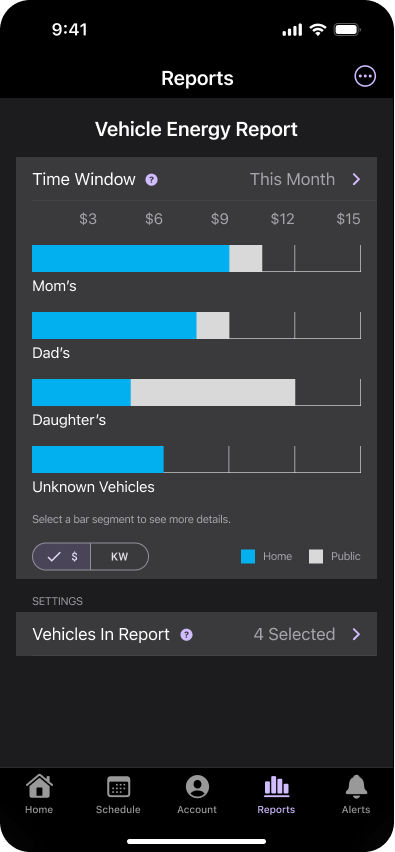

<h1 id="top" align="center">Danlaw Smart Charger</h1> 

## Table of Contents

- [Description](#description)
- [Features](#features)
- [Roadmap](#roadmap)
- [Packages](#packages)
- [Support](#support)
- [Design](#design)
- [Screenshots](#screenshots)
- [License](#license)

## Description

Danlaw Smart Charger provides a simple interface for users to monitor the charging status of their EVs, plan custom charging schedules and setup various alerts. 
 
## Features

- **Account**: New users need to create an account to access the features of the app. 
- **Authentication**: After account creation, users can login with email & password.
- **Household**:
    - Users can add up to 3 households per account.
    - Household details can be changed.   
- **Charger**:
    - Users can add up to 3 chargers per household.
    - Chargers can be added with scanning a QR code or Bluetooth flow.
- **Vehicle**:
    - Users can add up to 6 vehicles per household. 
    - Vehicles can be added with scanning a QR code or Bluetooth flow.
    - Diagnostic Trouble Codes can be accessed from details page.
- **Alert**:
    - Alerts are grouped by Vehicles and Chargers.
    - Users can be alerted by Push Notifications, Email and SMS.
    - Alerts can be set based on remaining miles, charge status, etc..
- **Schedule**: Users can see and set charging schedules for the week. 
- **Reports**: Energy reports are available for all the vehicles and chargers. Table can be grouped by chargers.   

## Roadmap

- [ ] Update Add Charger Flow
- [ ] Update Add Vehicle Flow
- [ ] Add more tests
- [ ] Add language selection

>**Note:** Some of the items on the roadmap might be tackled at the next phase of development. 

## Packages

These are the main packages used in the app:

- [Flutter Riverpod](https://pub.dev/packages/flutter_riverpod) for data caching, dependency injection, and more
- [Riverpod Generator](https://pub.dev/packages/riverpod_generator) and [Riverpod Lint](https://pub.dev/packages/riverpod_lint) for the latest Riverpod APIs
- [GoRouter](https://pub.dev/packages/go_router) for navigation
- [Intl](https://pub.dev/packages/intl) for date, time formatting
- [Mocktail](https://pub.dev/packages/mocktail) for testing
- [Equatable](https://pub.dev/packages/equatable) to reduce boilerplate code in model classes
- [flutter_blue_plus](https://pub.dev/packages/flutter_blue_plus) to communicate with Charger and Vehicle via Bluetooth 
- [Reflectable](https://pub.dev/packages/reflectable) to automate widget generation from bespoke objects 

See the [pubspec.yaml](pubspec.yaml) file for the complete list.

## Support
Application support by [Danlaw](https://danlawtechnologies.com/contactus).

Platform support:
- Android: SDK 34+
- iOS: iOS 17.0+  

Localization support: 
- United States English
- Canadian French
- Mexican Spanish

Currently application uses default language of the device. If device language is not supported defaults to Engligh.

## Design 

Current designs for this application can be found at [Figma](https://www.figma.com/design/Ji08JojX9t4N5U4uhjgH55/DAN003---EV-Charger-App?node-id=315-20822&t=r8H62xjxlTNpKI6r-0). 

## Screenshots

    &nbsp;&nbsp;&nbsp;&nbsp;&nbsp;
    &nbsp;&nbsp;&nbsp;&nbsp;&nbsp;  
    

     &nbsp;&nbsp;&nbsp;&nbsp;&nbsp;
     &nbsp;&nbsp;&nbsp;&nbsp;&nbsp;
    

     
     
    

## License
Copyright © 2024. All rights reserved by [Danlaw](https://danlawtechnologies.com/terms-conditions).

  

[Back to Top](#top)